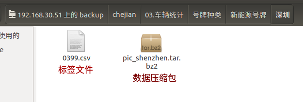

# 车牌识别(CLPR)处理车检(VAI)数据流程及操作手册


## 1. 数据说明
车检数据来源主要有如下两个：
- 姚总(姚绍军 Email: yaoshaojun@em-data.com.cn) 数据地址: 192.168.30.51 账号: chejian_user 密码: hellochejian
- 罗于洋(车检员工 Email: luoyuyang@em-data.com.cn) 数据地址: 192.168.20.99

以上数据的详细地址需要具体询问，以他们发给你的邮件为准，每次数据记得劳烦他们抄送何娜(Email: hena@em-data.com.cn)一份！

车检数据主要由两种状态：
1. 有中文标签(一般通过姚总途径获取图片及对应标签的csv文件)


 * 0399.csv的格式及说明如下，下表是提取0399.csv中4行进行示例说明:

 | 号牌号码(车牌非中文部分)| 日期 | - | - | - | 认证机构(车牌前2位)
 | --- | --- | --- | --- | --- | ----
 |hphm|	DATE(vehicle_checks.created_at)| device_id|	jyjgbh|	rlzl| fzjg
 |BD47865| 2018-07-27| 0| 4400000483| C | NULL
 |BD40947| 2018-08-17| 0| 4400000152| C | 粤B
 |B3721	| 2018-08-18 | 0| 4400000472| C	| 粤O

 注: 如果fzjg存在O(大写英文O不是零), 一般情况是车牌第二位不确定或者0. 如上表第二条则表示车牌号为`粤BD40947`

 * 数据压缩包解压后一般有两种形式

    1. 由hphm(号牌号码)命名的文件夹，每个文件夹中包含1-7张图片(同一辆车测不同项目)
    2. 都是图片，没有根据hphm分文件夹


2. 只有非中文部分标签

图片的命名格式如下: 0322_B35926D_LC06S24P3H1993805_4400000138.jpg

其中第二位即为hphm，所以有中文标签的时候，可以根据hphm对图片进行重命名，命名为: 粤B35926D_0322_B35926D_LC06S24P3H1993805_4400000138.jpg（车牌号_原始名称）


## 2. 操作流程

### 2.0 准备工作 - QT配置
从smb://192.168.20.66/公共的/tools/中copy plate_detect文件夹(这个文件夹是车检车牌定位及处理的简化版工程)

1. 修改`chepai_test_data_project.pro`中`CAFFE_ROOT_PATH`，`OPENCV_ROOT_PATH`，`CUDA_ROOT_PATH`， `PROTOBUF_ROOT_PATH`
2. 修改`main.cpp`中的模型路径,模型都放在工程文件夹的model目录下
3. 修改`main.cpp`中`main`函数中`img_dir`改为需要处理的文件目录

### 2.1 有中文标签
#### 2.1.1 下载数据
#### 2.1.2 根据有标签的csv对文件命名
修改`alchemy/ocr/clpr/data/vai_data/vai_plate_rename.py`中处理的数据路径

    ```
    python3 alchemy/ocr/clpr/data/vai_data/vai_plate_rename.py
    ```
#### 2.1.3 核实标签
#### 2.1.4 整理已确认标签的数据，找回标注完毕的车辆图及对应定位的txt文件
修改`alchemy/ocr/clpr/data/vai_data/sorting_cheched_vaidata.py`中处理的数据路径

    ```
    python3 alchemy/ocr/clpr/data/vai_data/sorting_cheched_vaidata.py
    ```
---

### 2.2 只有非中文部分标签
这部分数据主要由车检的罗余洋提供，里面是正常的一个车检会遇见的一个分布，没有根据车牌类别进行分类，所以数据保存的根目录是`vai`(来自车检的数据)
#### 2.2.1 下载数据
从车检那边下载数据保存至 */data/clpr/vai/batchX_time*(X:第几次获取, time: 获取日期 例如./batch6_20190123)

#### 2.2.2 获取车辆及车牌图片及对应坐标txt
1. QT打开plate_detect工程，并修改`main.cpp`中`main`函数中`img_dir`改为需要处理的文件目录(例如:如下img_dir为保存数据的根目录, 图片解压后的文件夹重名名为`img`)

    ```
    string img_dir = "./data/clpr/vai/batch6_20190123";
    // 运行 plate_detect
    ```
    工程会在./data/clpr/vai/batch6_20190123分别生成如下几个文件夹，下表附上解释说明:

    | 文件夹 | 解释
    | --- | ---
    | car | 车检定位出来的车辆图
    | img | 拷贝下来的原始车检图片
    | plate | 不做任何拓边的车检的定位结果图(都是车牌)且车牌识别模型结果(非中文部分)与标签一致的图片
    | plate_error |不做任何拓边的车检的定位结果图(都是车牌)且车牌识别模型结果(非中文部分)与标签不一致的图片
    | txt | plate文件夹所对应的车辆图片(car文件夹中)的车牌检测位置txt(保存为"x y w h")
    | txt_error | plate_error文件夹所对应的车辆图片(car文件夹中)的车牌检测位置txt(保存为"x y w h")

2. 对车牌进行分类(5类: 0-白牌 1-单黄 2-双黄 3-蓝 4-新能源)
    ```
    # 打开本工具(alchemy) 后面是图片根目录(建议绝对路径)
    python alchemy/ocr/clpr/cls/plate_cls.py  --img_dir ./data/clpr/vai/batch6_20190123/plate

    python alchemy/ocr/clpr/cls/plate_cls.py --img_dir  ./data/clpr/vai/batch6_20190123/plate_error
    ```
    * 如果有问题:
        1. 首先检查`alchemy/caffe/classification/classify_class.py`中的`caffe_root`是否更改为自己的分类caffe路径;
        2. 其次检查`alchemy/ocr/clpr/cls/plate_cls.py`中的`parse_args()`模型路径是否更改为自己的放置车牌分类模型的路径;

3. 给图片打标签
    ```
    python alchemy/ocr/clpr/data/vai_data/pic_check_rec_data.py --img_root ./data/clpr/vai/batch6_20190123/plate

    python alchemy/ocr/clpr/data/vai_data/pic_check_rec_data.py --img_root ./data/clpr/vai/batch6_20190123/plate_error
    ```
注: 2,3两步操作可以自己写一个bash脚本，这样比较方便，我是为了避免其中一个环节出错，所以没有提供bash脚本

4. 挑选数据
    数据挑选有如下几条原则:
    1. 优先处理plate_error中的数据，因为是模型数字识别错误，对模型提升贡献更大
    2. 处理数据的时候先按照大小排序，数据从后面往前面提取若干批次，比如每5000张作为一个批次
    3. 处理plate的文件夹的时候，由于非中文都匹配过了，所以检查数据错误的时候主要检查中文部分即可, 这一点可以和数据部说明，加快标注修改进度(何娜的速度是一天检查及修改1W张)
    4. 现在的数据获取及清洗主要根据模型缺陷去提取，具体的见之后会提供的发证机构分布表
    5. 返回了数据/挑选清洗了数据之后在当前目录如./data/clpr/vai/batch6_20190123下新建一个bathK_data 如 “batch0_20190126”(一般我们默认batch0为模型识别错误的批次)
    6. 这一批次加入训练的时候，一般对于batch0(之前模型没有正确识别的部分)进行数据拓增，其他的暂时不用

5. 找回标注完毕的车辆图及对应定位的txt文件
    修改`alchemy/ocr/clpr/data/vai_data/sorting_cheched_vaidata.py`中处理的数据路径
    ```
    python3 alchemy/ocr/clpr/data/vai_data/sorting_cheched_vaidata.py
    ```